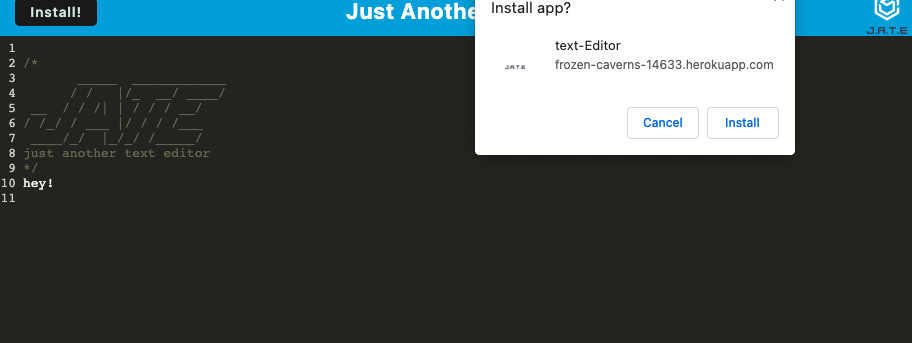
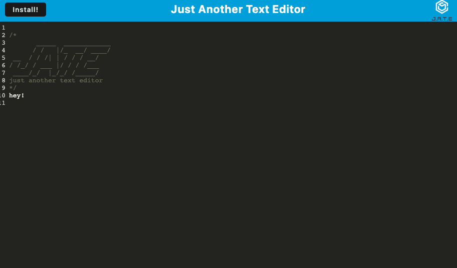

# Text Editor

## Table of Contents

- [Description](#description)
- [installation](#installation)
- [Usage](#usage)
- [License](#license)
- [Contributing](#contributing)
- [Tests](#tests)
- [Questions](#questions)

## Description

This is a single-page application app that meets the PWA criteria. In addition, it features number of data persistence techniques that serve as redundancy in case one of the options is not suported by the browser. The application also functions offline.

## Installation

The application requires the installation of Node.js and additional npm packages.

## Usage

The text editor implements methods for getting and storing data to an indexedDB databses. The use of idb package is required.

## License

Licensed under the [MIT](http://choosealicense.com/licenses/mit/) license.

## Questions

[The URL of the GitHub repository.](https://github.com/LizaS2022/text-editor.git)

[The URL of the deployed application.](https://frozen-caverns-14633.herokuapp.com/)
